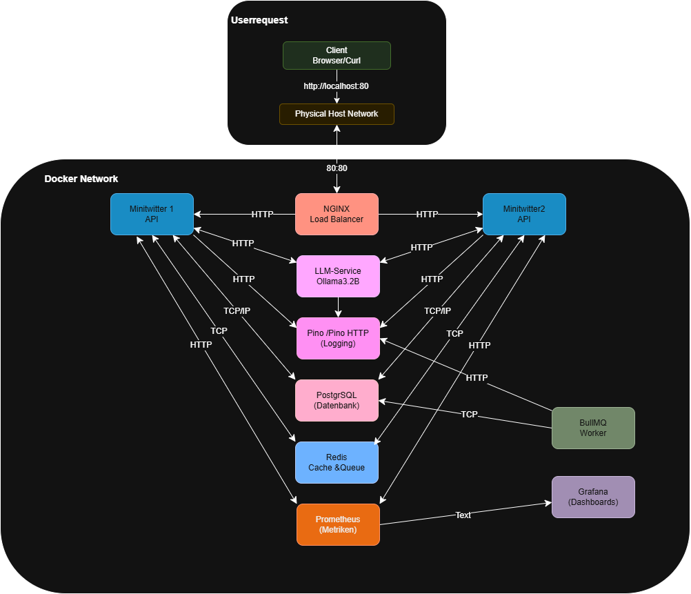

# 📌 Project Architecture: Minitwitter with Llama3.2:1B Sentiment Analysis

## 🏗️ Architecture Overview
This document describes the architecture of our distributed system, which is based on **Docker containers**. The services communicate via **HTTP** and **TCP**, utilizing **Redis as a cache & queue**, **PostgreSQL as a database**, and **Llama3.2:1B as a sentiment analysis service**.

---

## 📊 **Architecture Diagram**

---

## 📡 **Communication Paths Between Services**

### 1️⃣ **Client → NGINX Load Balancer**
   - **Protocol:** HTTP (Port 80)
   - **Purpose:** Distributes requests to the appropriate backend services.

### 2️⃣ **NGINX Load Balancer → Microservices**
   - **Protocol:** HTTP
   - **Direction:** The load balancer forwards requests to:
     - Minitwitter 1 API
     - Minitwitter 2 API
     - LLM Service (Llama3.2:1B)

### 3️⃣ **Minitwitter 1 & 2 APIs**
   - **HTTP** ⬄ **LLM Service (Llama3.2:1B)** → Sentiment analysis of texts.
   - **TCP** ⬄ **PostgreSQL Database** → Persistent storage for tweets, users, etc.
   - **TCP** ⬄ **Redis (Cache & Queue)** → Fast queries & job queue.
   - **HTTP** → **Pino Logging** → API request logging.
   - **HTTP** → **Prometheus** → Provides performance metrics.

### 4️⃣ **LLM Service (Llama3.2:1B)**
   - **HTTP** ⬄ **Minitwitter 1 & 2 APIs** → Text analysis.
   - **HTTP** → **Pino Logging** → Logs API usage.
   - **TCP** ⬄ **Redis (Cache & Queue)** → Stores temporary data.

### 5️⃣ **Pino Logging**
   - **HTTP** ⬄ **Minitwitter 1 & 2 APIs**, **LLM Service** → Receives logs.
   - **TCP** ⬄ **PostgreSQL** → Long-term log storage.

### 6️⃣ **PostgreSQL Database**
   - **TCP** ⬄ **Minitwitter 1 & 2 APIs** → CRUD operations.
   - **TCP** ⬄ **Pino Logging** → Stores logs.
   - **TCP** ⬄ **Redis (optional)** → If persistent cache data is needed.

### 7️⃣ **Redis Cache & Queue**
   - **TCP** ⬄ **Minitwitter 1 & 2 APIs** → Caches frequently used data.
   - **TCP** ⬄ **BullMQ Worker** → Manages asynchronous jobs.
   - **TCP** ⬄ **Prometheus** → Provides cache performance metrics.

### 8️⃣ **BullMQ Worker**
   - **TCP** ⬄ **Redis** → Retrieves jobs from the queue.
   - **TCP** ⬄ **PostgreSQL** → Stores processed data.

### 9️⃣ **Prometheus**
   - **HTTP** ⬄ **Minitwitter 1 & 2 APIs** → Scrapes metrics.
   - **HTTP** ⬄ **Redis** → Performance monitoring.

### 🔟 **Grafana**
   - **HTTP** ⬄ **Prometheus** → Displays collected metrics.

---

## 🛠️ **Technology Stack**
| Technology        | Purpose                          |
|------------------|--------------------------------|
| **Docker**       | Container orchestration       |
| **NGINX**        | Load balancing               |
| **Node.js**      | Backend framework for APIs   |
| **Express.js**   | Web server for microservices |
| **PostgreSQL**   | Relational database         |
| **Redis**        | Cache & message queue       |
| **BullMQ**       | Task queue for background jobs |
| **Pino**         | Logging                      |
| **Prometheus**   | Monitoring                   |
| **Grafana**      | Visualization of metrics    |
| **Llama3.2:1B**  | LLM for sentiment analysis  |

---

## 🏆 **Conclusion**
The system is **modular**, **scalable**, and utilizes **microservices** with **Docker**.  
Key features:
- **Horizontal scalability** through load balancing.
- **Asynchronous processing** with Redis and BullMQ.
- **Real-time monitoring** with Prometheus & Grafana.
- **Sentiment analysis with Llama3.2:1B** for text classification.
