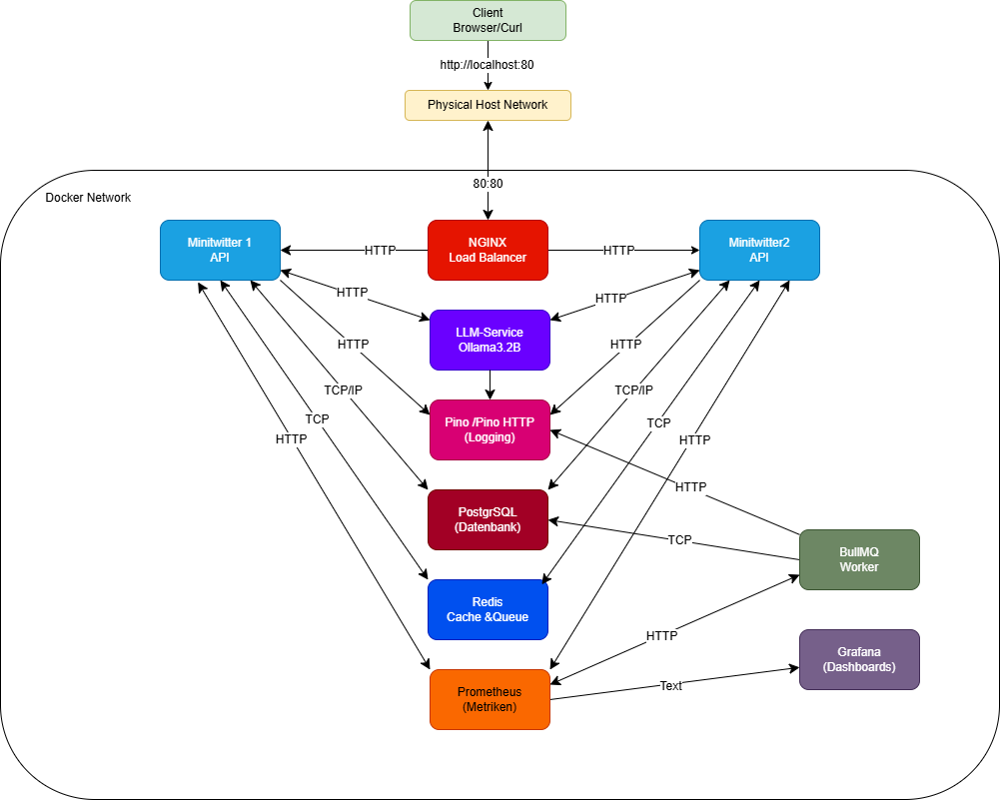

# 📌 Projekt-Architektur: Minitwitter mit Ollama Sentiment-Analyse

## 🏗️ Architekturübersicht
Dieses Dokument beschreibt die Architektur unseres verteilten Systems, das auf **Docker-Containern** basiert. Die Services kommunizieren über **HTTP** und **TCP**, wobei **Redis als Cache & Queue**, **PostgreSQL als Datenbank** und **Ollama (1.5B) als Sentiment-Analyse-Service** genutzt werden.

---

## 📊 **Architekturdiagramm**

---

## 📡 **Kommunikationswege zwischen den Services**

### 1️⃣ **Client → NGINX Load Balancer**
   - **Protokoll:** HTTP (Port 80)
   - **Zweck:** Verteilt Anfragen an die richtigen Backend-Services.

### 2️⃣ **NGINX Load Balancer → Microservices**
   - **Protokoll:** HTTP
   - **Richtung:** Load Balancer leitet Anfragen weiter an:
     - Minitwitter 1 API
     - Minitwitter 2 API
     - LLM-Service (Ollama 3.2B)

### 3️⃣ **Minitwitter 1 & 2 APIs**
   - **HTTP** ⬄ **LLM-Service (Ollama 3.2B)** → Sentiment-Analyse von Texten.
   - **TCP** ⬄ **PostgreSQL Datenbank** → Persistente Speicherung von Tweets, Nutzern, etc.
   - **TCP** ⬄ **Redis (Cache & Queue)** → Schnelle Abfragen & Job-Warteschlange.
   - **HTTP** → **Pino Logging** → API-Request-Logging.
   - **HTTP** → **Prometheus** → Performance-Metriken bereitstellen.

### 4️⃣ **LLM-Service (Ollama 3.2B)**
   - **HTTP** ⬄ **Minitwitter 1 & 2 APIs** → Analyse von Texten.
   - **HTTP** → **Pino Logging** → Logging der API-Nutzung.
   - **TCP** ⬄ **Redis (Cache & Queue)** → Speicherung temporärer Daten.

### 5️⃣ **Pino Logging**
   - **HTTP** ⬄ **Minitwitter 1 & 2 APIs**, **LLM-Service** → Empfang von Logs.
   - **TCP** ⬄ **PostgreSQL** → Langzeit-Logspeicherung.

### 6️⃣ **PostgreSQL Datenbank**
   - **TCP** ⬄ **Minitwitter 1 & 2 APIs** → CRUD-Operationen.
   - **TCP** ⬄ **Pino Logging** → Speicherung von Logs.
   - **TCP** ⬄ **Redis (optional)** → Falls persistente Cache-Daten benötigt werden.

### 7️⃣ **Redis Cache & Queue**
   - **TCP** ⬄ **Minitwitter 1 & 2 APIs** → Caching von häufig genutzten Daten.
   - **TCP** ⬄ **BullMQ Worker** → Verwaltung asynchroner Jobs.
   - **TCP** ⬄ **Prometheus** → Metriken zur Cache-Performance.

### 8️⃣ **BullMQ Worker**
   - **TCP** ⬄ **Redis** → Holt Jobs aus Queue.
   - **TCP** ⬄ **PostgreSQL** → Speichert verarbeitete Daten.

### 9️⃣ **Prometheus**
   - **HTTP** ⬄ **Minitwitter 1 & 2 APIs** → Scraping von Metriken.
   - **HTTP** ⬄ **Redis** → Performance-Monitoring.
   - **HTTP** ⬄ **BullMQ Worker** → Überwachung von Hintergrundprozessen.

### 🔟 **Grafana**
   - **HTTP** ⬄ **Prometheus** → Anzeige der gesammelten Metriken.

---

## 🛠️ **Technologie-Stack**
| Technologie        | Zweck                           |
|-------------------|--------------------------------|
| **Docker**       | Container-Orchestrierung       |
| **NGINX**        | Load Balancer                  |
| **Node.js**      | Backend-Framework für APIs     |
| **Express.js**   | Web-Server für Microservices   |
| **PostgreSQL**   | Relationale Datenbank          |
| **Redis**        | Cache & Message-Queue          |
| **BullMQ**       | Task-Queue für Hintergrundjobs |
| **Pino**         | Logging                        |
| **Prometheus**   | Monitoring                     |
| **Grafana**      | Visualisierung von Metriken    |
| **Ollama 3.2B**  | LLM für Sentiment-Analyse      |

---

## 🏆 **Schlussfolgerung**
Das System ist **modular**, **skalierbar** und nutzt **Microservices** mit **Docker**.  
Wichtige Features:
- **Horizontale Skalierbarkeit** durch Load Balancing.
- **Asynchrone Verarbeitung** mit Redis und BullMQ.
- **Echtzeit-Monitoring** mit Prometheus & Grafana.
- **Sentiment-Analyse mit Ollama LLM** zur Textklassifikation.

🚀 **Fazit:** Die Architektur ist bereit für produktive Anwendungen!
