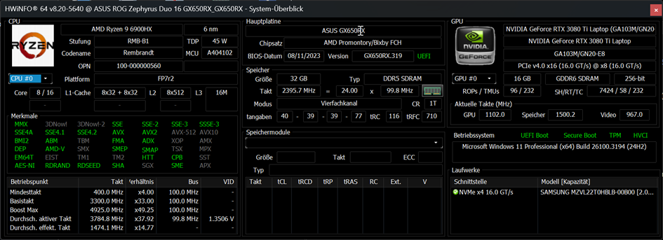
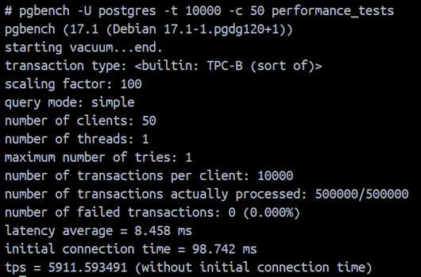
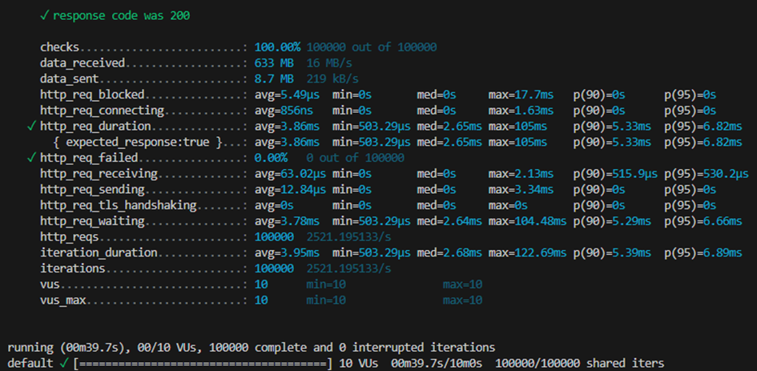
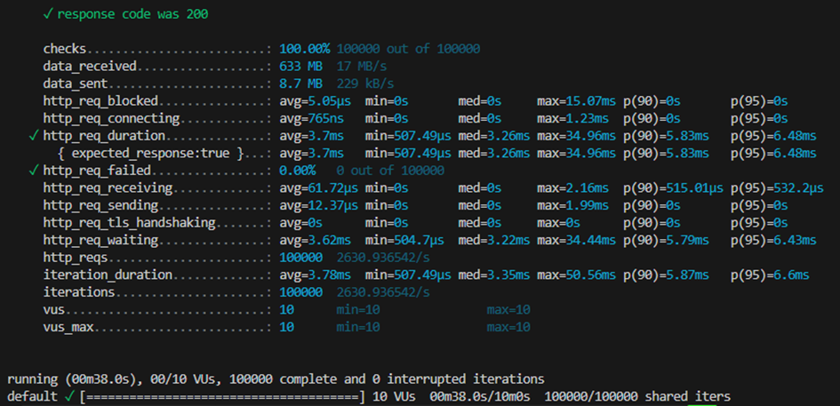
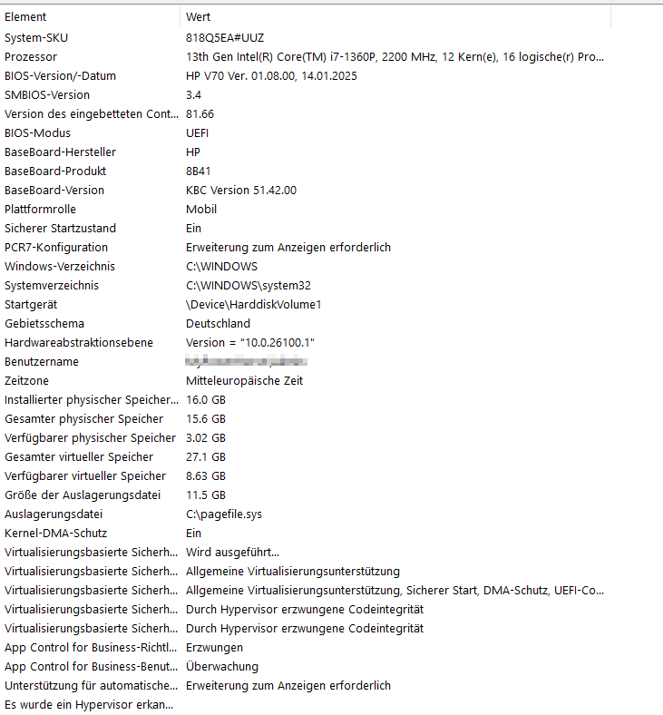
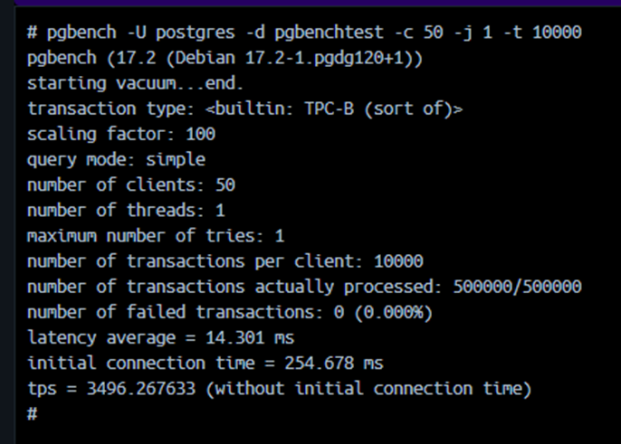
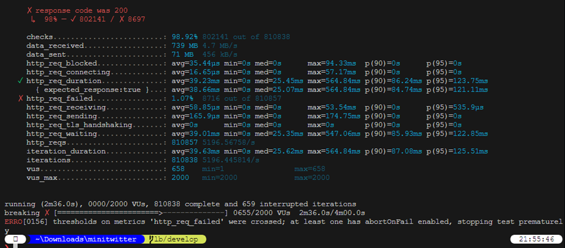
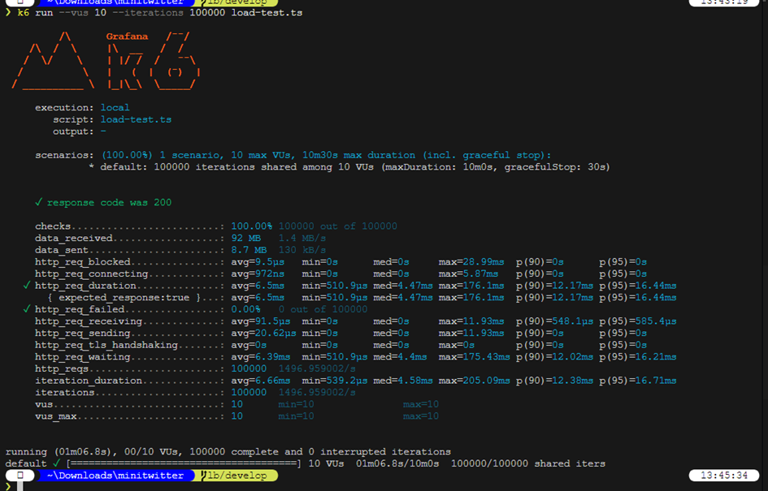

# Documentation of Performance - Tests

Here are some impressions with sveral hardware, how the database performs.
Therefore we show some screens of every member in this small study team.

## Spooner8

**System**


**pgbench**

Szenario: 10'000 transactions with 50 users on demo database

```bash
pgbench -U postgres -t 10000 -c 50 -d performance_tests
```



**K6 - Load test with cache**

Szenario: 100'000 iterations with 10 users

```bash
k6 run -u 10 -i 100000 .\src\performance\load-test.ts
```



**K6 - Load test without cache**

Szenario: 100'000 iterations with 10 users without using cash

```bash
k6 run -u 10 -i 100000 .\src\performance\load-test.ts
```



**K6 - Stress test with cache**
```ts
scenarios: {
    breaking: {
        executor: 'ramping-vus',
        stages: [
        { duration: '10s', target: 10 },
        { duration: '20s', target: 20 },
        { duration: '20s', target: 50 },
        { duration: '20s', target: 100 },
        { duration: '20s', target: 200 },
        { duration: '50s', target: 500 },
        { duration: '50s', target: 1000 },
        { duration: '50s', target: 2000 },
        ],
    },
},
```

```bash
k6 run .\src\performance\stress-test.ts
```


## SyntaxWizzardBB

**System**


**pgbench**

Szenario: 10'000 transactions with 50 users on demo database

```bash
pgbench -U postgres -t 10000 -c 50 -d performance_tests
```



**K6 - Load test with cache**

Szenario: 100'000 iterations with 10 users

```bash
k6 run -u 10 -i 100000 .\src\performance\load-test.ts
```



**K6 - Load test without cache**

Szenario: 100'000 iterations with 10 users without using cash

```bash
k6 run -u 10 -i 100000 .\src\performance\load-test.ts
```



**K6 - Stress test with cache**
```ts
scenarios: {
    breaking: {
        executor: 'ramping-vus',
        stages: [
        { duration: '10s', target: 10 },
        { duration: '20s', target: 20 },
        { duration: '20s', target: 50 },
        { duration: '20s', target: 100 },
        { duration: '20s', target: 200 },
        { duration: '50s', target: 500 },
        { duration: '50s', target: 1000 },
        { duration: '50s', target: 2000 },
        ],
    },
},
```

```bash
k6 run .\src\performance\stress-test.ts
```


